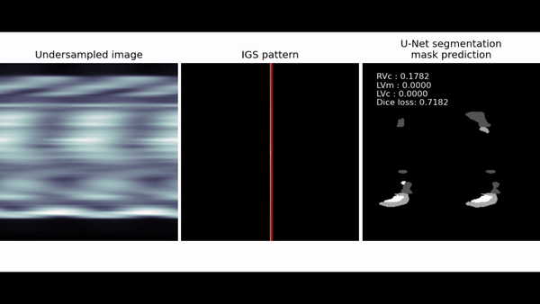

[](https://www.apache.org/licenses/LICENSE-2.0)
[](https://python.org)

# Iterative Gradient Sampling (IGS)

This repository provides the official PyTorch implementation of Iterative Gradient Sampling (IGS) methods that introduces approach to segmentation and classification which dramatically reduces k-space fractions and introduces a novel method for pathology diagnostics.

<p align="center">


</p>
<p align="center">
<em>Demonstration of k-space patterning via IGS algorithm featuring segmentation results with the ACDC dataset.</em>
</p>


## Abstract
Establishing diagnosis based on clinical MRI images classification and segmentation is a challenging problem due to time required for MRI acquisition and subsequent interpretation by an expert.

MRI diagnostic can be accelerated by using k-space undersampling and applying deep-learning models for automatic diagnosing. In this work we propose k-space undersampling pattern optimization for specific segmentation and classification models. 

In addition, compared to other state-of-the-art segmentation and classification networks our approach demonstrates better performance by increasing the accuracy of the predictions while reducing the standard deviation and improving the structural similarity. 

A series of ablation experiments support the importance of the gradient frequency sampling in the proposed architecture.

## Usage

### 0. Cloning the repository

```bash
$ git clone https://github.com/cviaai/IGS.git
$ cd IGS-SEGMENT/
```

### 1. Creating python environment

```bash
$ conda env create -f igs.yml
$ conda activate igs
```

### 2. Datasets

IGS is trained to work with the major public medical datasets to resolve the following medical tasks:
1. Segmentation (BraTS2020 for brain tumor segmentation, ACDC for cardiac segmentation)
2. Classification (BraTS2020 total amount of slices being split into tumor/not tumor classes)
3. Image reconstruction (raw k-space from FastMRI dataset, undersampled ACDC, BraTS)

### 3. Training

Training on BRATS dataset

```bash
$ python main.py --mode train --dataset BRATS --crop_size 256 --image_size 256 --c_dim 1 \
                 --image_dir data/brats/syn \
                 --sample_dir brats_syn_256_lambda0.1/samples \
                 --log_dir brats_syn_256_lambda0.1/logs \
                 --model_save_dir brats_syn_256_lambda0.1/models \
                 --result_dir brats_syn_256_lambda0.1/results \
                 --batch_size 8 --num_workers 4 --lambda_id 0.1 --num_iters 300000
```

### 4. Testing

Testing on BRATS dataset

```bash
$ python main.py --mode test_brats --dataset BRATS --crop_size 256 --image_size 256 --c_dim 1 \
                 --image_dir data/brats/syn \
                 --sample_dir brats_syn_256_lambda0.1/samples \
                 --log_dir brats_syn_256_lambda0.1/logs \
                 --model_save_dir brats_syn_256_lambda0.1/models \
                 --result_dir brats_syn_256_lambda0.1/results \
                 --batch_size 16 --num_workers 4 --lambda_id 0.1 --test_iters 300000
```

### 5. Testing using pretrained models

Testing on BRATS dataset using pretrained models

```bash
$ bash download.sh pretrained_brats_256
$ python main.py --mode test_brats --dataset BRATS --crop_size 256 --image_size 256 --c_dim 1 \
                 --image_dir data/brats/syn --sample_dir brats_syn_256_lambda0.1/samples \
                 --log_dir brats_syn_256_lambda0.1/logs \
                 --model_save_dir pretrained_models/brats_syn_256_lambda0.1 \
                 --result_dir brats_syn_256_lambda0.1/results \
                 --batch_size 16 --num_workers 4 --lambda_id 0.1 --test_iters 300000
$ python brats_auc.py
```

## Citation

Please cite this work as following:

```
@misc{razumov-IGS,
  author = {Artem Razumov and Oleg Rogov and Dmitry V. Dylov},
  title = {Smart mask learning for segmentation},
  year = {2021},
  publisher = {GitHub},
  journal = {GitHub repository},
  howpublished = {\url{https://github.com/cviaai/IGS-SEGMENT}}
}
```
